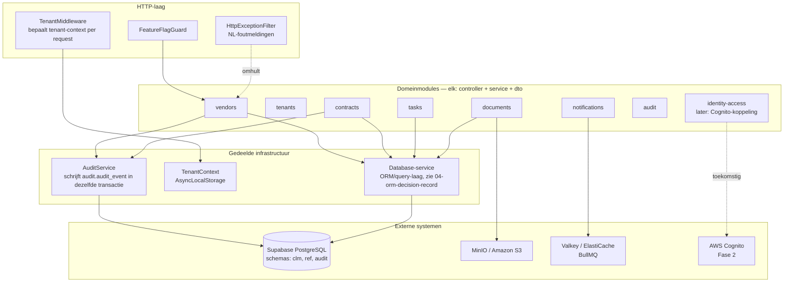
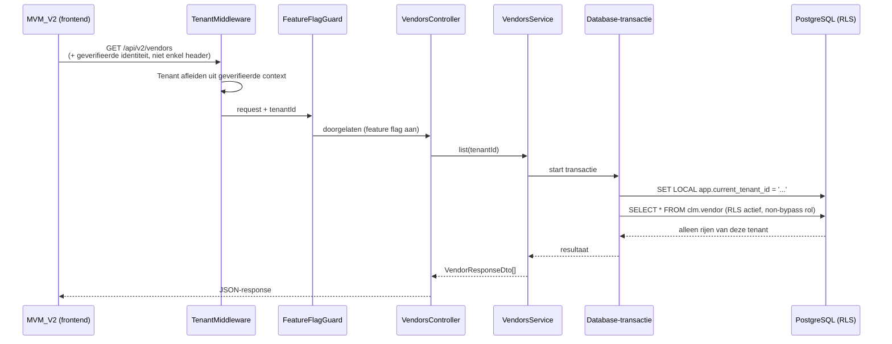

# Target Architecture — MCM2

Voorgestelde modulaire-monolith-indeling. Dit is een voorstel, geen reeds gebouwde structuur — Fase 0 bevat nu alleen `health`, `prisma` en `common/tenant`.

---

## Modulegrenzen



## Dataflow — één request, end-to-end



## Tenantcontextflow — huidig vs. voorgesteld

**Huidig (Fase 0, bevestigd risico — zie 03-data-security-and-rls.md):**
```
Client stuurt X-Tenant-Id header of ?tenant=naam
  → TenantMiddleware vertrouwt deze waarde direct
  → geen koppeling aan geverifieerde identiteit
```

**Voorgesteld (vanaf het moment dat er meer dan één tenant met echte gebruikers is):**
```
Client authenticeert via Cognito → JWT bevat tenant-claim (geverifieerd, ondertekend)
  → TenantMiddleware/Guard valideert JWT, leest tenant-claim daaruit
  → client-header wordt genegeerd of alleen gebruikt voor expliciete "impersoneer tenant X"-scenario's
    met eigen autorisatiecontrole (bijv. support-rol)
  → databaseverbinding gebruikt een runtime-rol ZONDER BYPASSRLS
```

## Externe interfaces

| Interface | Richting | Protocol | Status |
|---|---|---|---|
| MVM_V2 → MCM2 | Frontend → backend | HTTP/JSON, `NEXT_PUBLIC_API_URL` | Endpoint-contract bevestigd voor vendors (`GET /api/v2/vendors`), 9 andere endpoints verwacht maar niet gebouwd |
| MCM2 → Supabase PostgreSQL | Backend → database | PostgreSQL-protocol, Session Pooler | Actief, rol-scheiding ontbreekt (zie 03) |
| MCM2 → MinIO/S3 | Backend → object storage | S3-API | Nog niet in code gebruikt (Fase 0 bouwt nog geen document-upload) |
| MCM2 → Valkey/ElastiCache | Backend → queue | Redis-protocol | Nog niet in code gebruikt (Fase 0 bouwt nog geen BullMQ-queue) |
| MCM2 → AWS Cognito | Backend → identity provider | OIDC/JWT | Fase 2, nog niet gebouwd |

## Wat bewust NIET wordt gebouwd (nu)

- Geen microservices — modulaire monolith is voldoende voor de huidige schaal en team-omvang (1 developer).
- Geen Kubernetes.
- **Geen volledige AWS-doelarchitectuur (ECS Fargate-cluster, alle beveiligingsdiensten) vóór Fase 5** — **bijgewerkt na de Transdev-scope-toevoeging:** wél een kleine, minimale AWS-acceptatieomgeving vóór de pilot (zie 06-prioritized-roadmap.md, BP8), om te bewijzen dat het Docker-image ook buiten de lokale machine draait. Dit is een bewuste, beperkte uitzondering — geen vooruitlopen op de volledige Fase 5-migratie, wel een klein, gecontroleerd stuk AWS-gebruik vóór de pilot.
- Geen eigen identity-provider — Cognito is een federatielaag vóór het bestaande Entra ID, geen vervanging.
- Geen contract-, task-, issue-, document-modules in Fase 0 — endpoint-voor-endpoint, vendor eerst.
- Geen eigen secrets-manager-implementatie in Fase 0 — lokale `.env` volstaat voor een team van 1; Doppler/1Password-CLI blijft een bewuste latere stap (zie MCM2-CLAUDE.md, sessiestatus).
